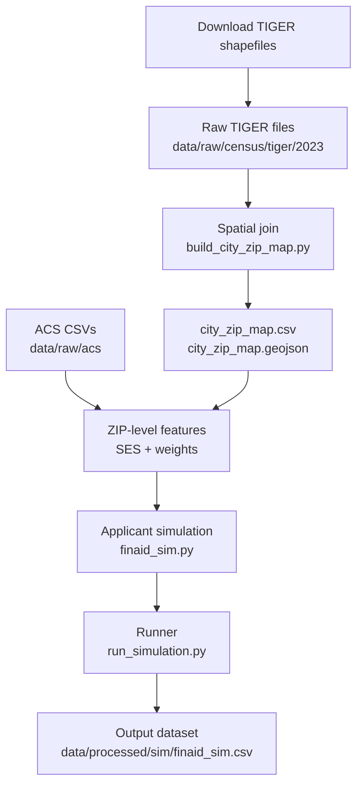

# Education-Data-Simulation-and-Analysis

This repository houses a data science demonstration project using simulated data
in the K–12 private education sector.

## Data setup

Download required TIGER shapefiles:

```bash
python -m src.ingestion.download_all_census
```

Download ACS ZCTA data

```bash
python -m src.ingestion.download_acs_zcta_detailed
python -m src.ingestion.download_acs_zcta_profile
```

Generate city-zip mappings via spatial join:

```bash
python -m src.features.build_city_zip_map
```

Build zip file

```bash
python -m src.ingestion.build_zip_df
```

Run simulation:

```bash
python -m src.simulation.run_simulation
```

## Repository structure

```text
.
├── README.md
├── .gitignore
├── requirements.txt
├── src/
│   ├── ingestion/
│   │   ├── __init__.py
│   │   ├── download_census.py
│   │   └── download_all_census.py
│   ├── features/
│   │   ├── __init__.py
│   │   └── build_city_zip_map.py
│   └── simulation/
│       ├── __init__.py
│       ├── finaid_sim.py
│       └── run_simulation.py
└── data/
    ├── raw/
    │   ├── census/
    │   │   └── tiger/
    │   │       └── 2023/
    │   │           ├── place/
    │   │           │   └── README.md
    │   │           └── zcta520/
    │   │               └── README.md
    │   └── acs/
    └── processed/
        ├── geo/
        └── sim/
```

## Pipeline overview



## Methods and modeling assumptions

This project uses a generative simulation framework to approximate applicant
flow, admissions decisions, financial aid allocations, and enrollment yield
for a hypothetical K–12 private school. All data are simulated, but parameter
choices are grounded in publicly available Census data and plausible constraints.

### Geographic foundation

Applicant ZIP codes are derived using U.S. Census TIGER/Line shapefiles:

- PLACE (Virginia) polygons define target cities
- ZCTA5 polygons define ZIP Code Tabulation Areas

ZIP codes are assigned to cities via spatial intersection. When a ZIP intersects
multiple cities, assignment is probabilistic based on overlap frequency to ensure
each ZIP maps to a single city for simulation purposes.

### Socioeconomic context (SES)

ZIP-level socioeconomic characteristics are derived from ACS 5-year estimates,
including:

- Median household income
- Median home value
- Percent of adults with a bachelor’s degree or higher

These measures are standardized and combined into a composite SES index, which
influences downstream applicant characteristics (e.g., income band, aid request
probability, academic indicators).

### Applicant generation

Applicants are simulated with the following attributes:

- Grade applying to (grade-specific volume assumptions)
- Tuition (grade-dependent)
- ZIP code and city (weighted by target city share)
- Race/ethnic minority status (grade- and SES-dependent)
- Gender (assumed 50/50)
- Family size
- Household income band
- Legacy status
- Presence of tuition-enrolled siblings

Dependencies are intentionally introduced to reflect realistic correlations
(e.g., SES with income band, family size with sibling enrollment, city with
legacy likelihood).

### Academic and holistic evaluation

Applicants receive multiple evaluation components:

- Standardized testing score
- Arts, athletics, leadership, and interview ratings

These components are simulated using correlated latent variables, with modest
SES gradients and small group-level effects to reflect real-world patterns
without hard-coding outcomes.

### Admissions decisions

Admissions offers are made using grade-specific seat constraints. Applicants
are ranked using a composite admissions index incorporating:

- Academic indicators
- Legacy status
- Income-related considerations

Seats are filled within each grade based on this ranking.

### Financial aid modeling

Financial aid is modeled conditional on:

- Offer status
- Aid request
- Income band
- Family characteristics

Aid amounts are expressed as a percentage of tuition and translated into dollar
values. Higher-need applicants receive larger awards on average, with stochastic
variation to avoid deterministic outcomes.

### Enrollment (yield)

Enrollment decisions are simulated for offered applicants using a logistic
framework influenced by:

- Financial aid generosity
- Income band
- Legacy and sibling status
- Academic indicators
- Grade-level baseline yield differences

The resulting dataset supports downstream analysis of yield, equity tradeoffs,
and counterfactual financial aid strategies.
